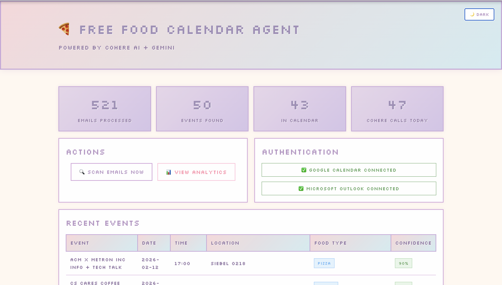
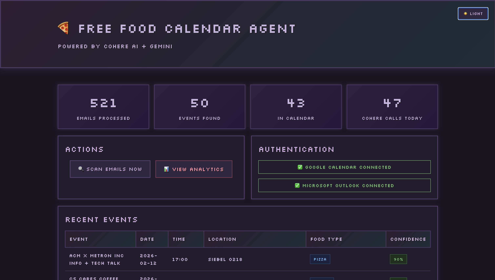
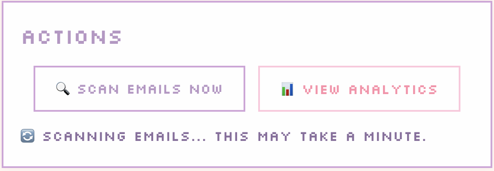
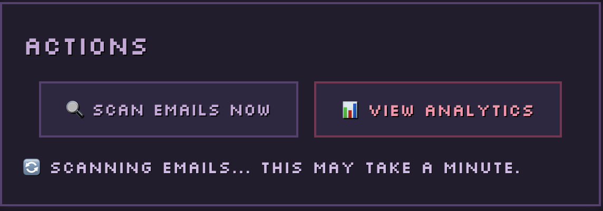
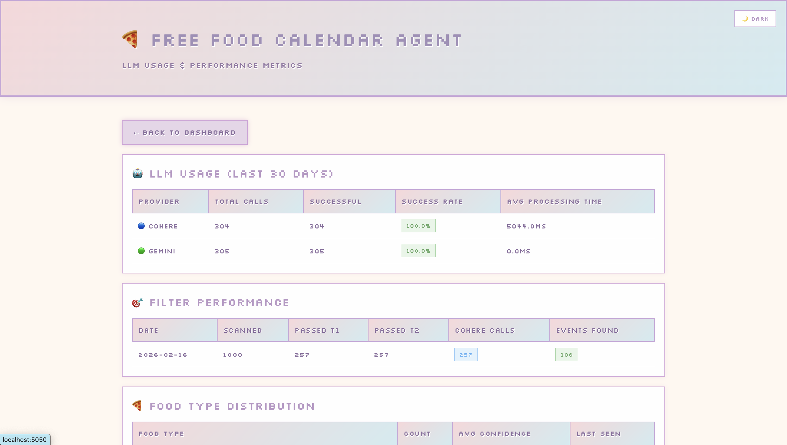
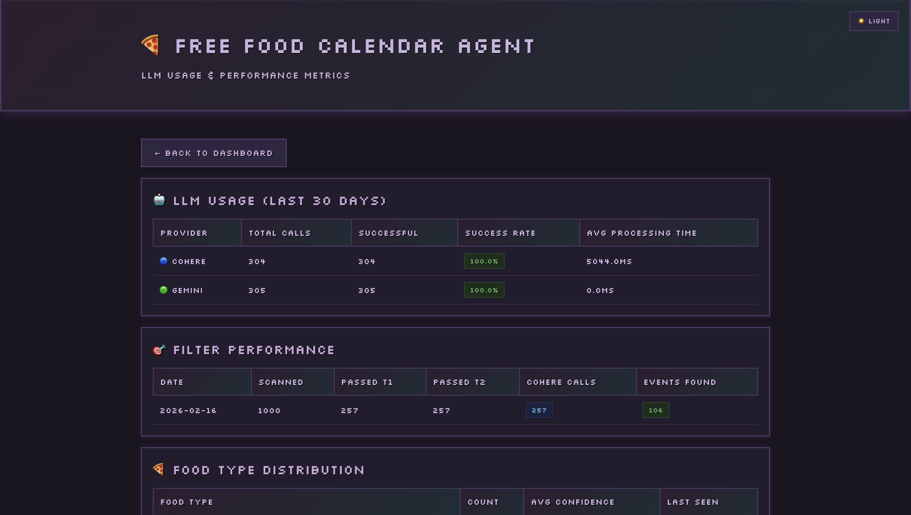

# Web Interface

The web interface provides a modern, pastel-themed dashboard with the following features.

## Screenshots

**Dashboard**

| Light Mode | Dark Mode |
|:---:|:---:|
|  |  |

**Scan in Progress**

| Light Mode | Dark Mode |
|:---:|:---:|
|  |  |

**Analytics**

| Light Mode | Dark Mode |
|:---:|:---:|
|  |  |

## Dashboard Features
- **Statistics Overview**: Total emails processed, events found, events in calendar, and Cohere calls today
- **Actions Panel**:
  - Scan emails manually with real-time progress updates
  - View detailed analytics
- **Authentication Panel**:
  - One-click Google Calendar authentication
  - One-click Microsoft Outlook authentication
  - Status indicators showing connection status
- **Recent Events Table**: View all recently found food events with details
- **Food Type Distribution**: See which food types are most common

## UI Design
- **Silkscreen Font**: Retro pixel-style font for a unique aesthetic
- **Responsive Layout**: Side-by-side cards for Actions and Authentication
- **Real-time Updates**: Live scan progress and results pop-up
- **Dark Mode**: Toggle between light and dark themes, preference saved across sessions

## Analytics & Monitoring

Access the analytics page at `http://localhost:5050/analytics` to view:

- **LLM Usage**: Cohere vs Gemini call counts, success rates
- **Filter Performance**: How many emails pass each tier
- **Food Type Distribution**: Pizza vs lunch vs snacks, etc.
- **Budget Tracking**: API calls remaining for the day
- **Real-time Scanning**: Trigger email scans directly from the web interface
- **Authentication Status**: See Google Calendar and Microsoft Outlook connection status
- **Recent Events**: View recently found food events with details
